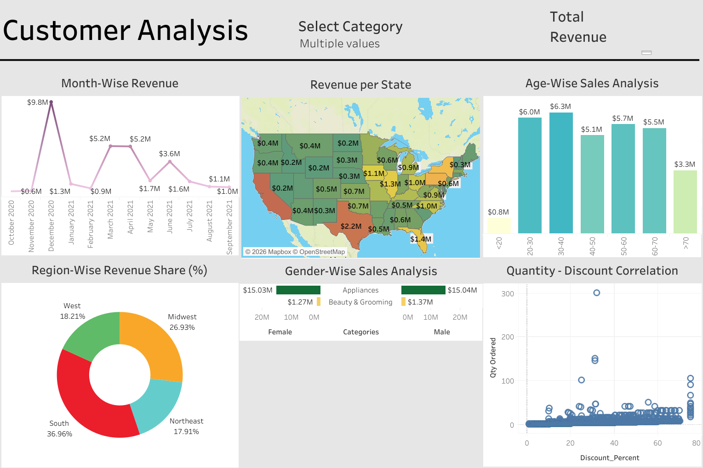

# Behavioral Shift Detection & Pattern Transition Analysis

## Overview

Behavioral Shift Detection & Pattern Transition Analysis is a critical business function that enables organizations to understand customer behavior, identify revenue drivers, and uncover opportunities for growth. This project uses **Tableau** to perform an in-depth **customer and revenue analysis** based on transactional sales data.

The objective is to transform raw sales data into **actionable insights** through interactive dashboards that support strategic decision-making in marketing, sales, and customer engagement.

---

## Objectives

- Analyze revenue trends over time  
- Identify high-performing states and regions  
- Understand customer demographics and purchasing behavior  
- Examine the impact of discounts on order quantity  
- Support data-driven business decisions using visualization  

---

## Dataset Description

The dataset contains historical sales transaction data, including:

- Order dates and revenue values  
- Customer demographics (age, gender)  
- Geographic information (state, region)  
- Product categories  
- Discount percentages and order quantities  

The dataset enables multi-dimensional analysis across **time, geography, and customer segments**.

---

## Solution Approach

### 1. Data Collection

Customer and sales data was collected from transactional records and consolidated into a structured dataset suitable for analysis.

---

### 2. Data Cleaning

The dataset was cleaned using data preprocessing techniques:

- Removed duplicate records  
- Handled missing and inconsistent values  
- Standardized categorical fields  
- Ensured correct data types for dates and numeric fields  

---

### 3. Data Preparation

- Aggregated revenue metrics at monthly, regional, and demographic levels  
- Created calculated fields for revenue contribution and percentages  
- Prepared data for Tableau visualization and interactivity  

---

## Tableau Dashboard Overview

The Tableau dashboard provides a comprehensive **Customer Analysis** view with dynamic filters and drill-down capabilities.

---

## Key Visualizations & Insights

### 1. Month-Wise Revenue

- Displays revenue trends across months  
- Highlights seasonal spikes and low-performing periods  
- Useful for sales forecasting and promotional planning  

---

### 2. Revenue per State

- Geographic heat map showing state-wise revenue contribution  
- Identifies top-performing and underperforming states  
- Supports regional sales strategy optimization  

---

### 3. Age-Wise Sales Analysis

- Compares revenue contribution across age groups  
- Reveals high-value customer segments  
- Enables targeted marketing strategies  

---

### 4. Region-Wise Revenue Share (%)

- Visualizes revenue distribution across regions  
- South region contributes the highest share, followed by Midwest  
- Helps prioritize regional investment and expansion  

---

### 5. Gender-Wise Sales Analysis

- Compares revenue by gender across product categories  
- Identifies category preferences among male and female customers  
- Supports personalized product positioning  

---

### 6. Quantity vs Discount Correlation

- Scatter plot showing relationship between discount percentage and quantity ordered  
- Reveals how discounts influence customer purchase volume  
- Assists in optimizing discount and pricing strategies  

---

## Business Value

This analysis helps businesses:

- Identify high-value customer segments  
- Improve regional and demographic targeting  
- Optimize discount strategies  
- Enhance customer experience through data-driven insights  
- Increase revenue and customer retention  

---

## Tools & Technologies Used

- Tableau  
- CSV / Excel datasets  
- Basic data preprocessing tools  

---

## Repository Structure

Customer-Analysis-using-Tableau/
│
├── Dashboard.png
├── CustomerAnalysis_v2022.3.twbx
├── sales_06_FY2020-21.csv
├── Behavioral_Shift_Detection.ipynb
├── Screenshots/
└── README.md

---

## Conclusion

This project demonstrates how **Tableau dashboards** can be used to convert raw customer data into meaningful insights. By analyzing revenue, geography, demographics, and discount behavior, the project provides a strong foundation for **customer-centric decision-making**.

---

This project is intended for educational and analytical purposes only.
